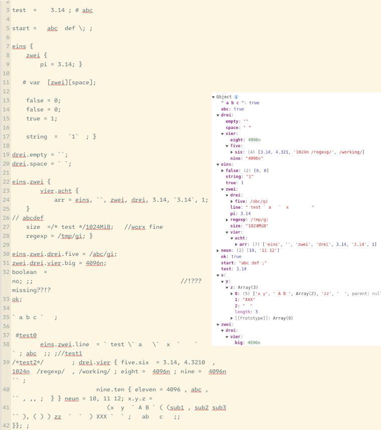

# Configuration files
This is first used in my `httpz` web server (which I'm currently working on): my own configuration files.

There are some more features planned. But atm it's capable of parsing my own syntax (errors can occure,
but they are usually being well-corrected), with some basic data/value types.

Comments are allowed (`#`, `//` and `/* .. */`), escaping with backslash `\` is also supported. Plus,
if you don't want to parse the values or want special cases like multiple spaces on the beginning or
so, e.g., you can also use one of three support quote characters.

Lists are also supported (don't know if maps are necessary), and also JavaScript expressions,
and much more planned (follows soon)!

## Example

