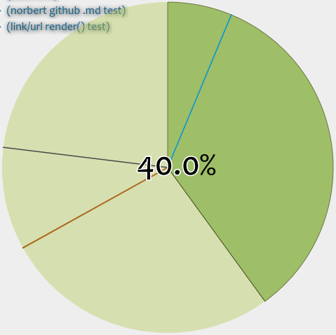

# **`progress`**.js
`class Progress extends HTMLCanvasElement`..

## Example
Beneath a 24h analog clock it also got it's own timer. But here's an example of the clock,
with enabled percentage (after **4pm** o'clock (so 16)):

