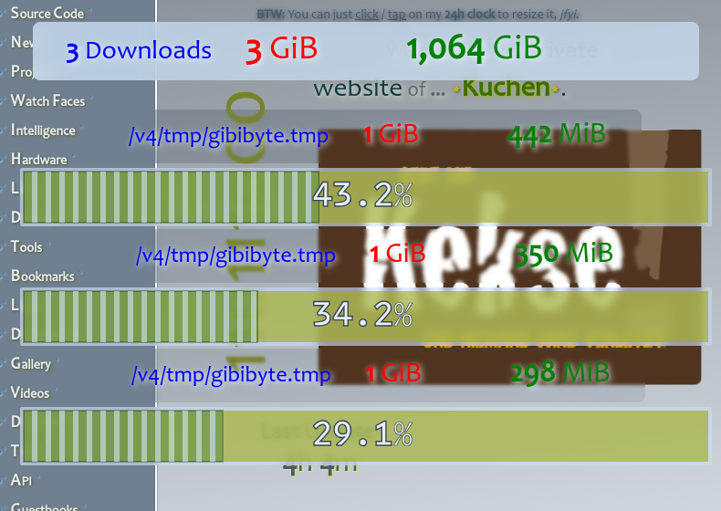
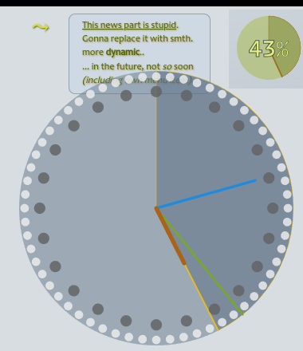

# `class Progress extends HTMLCanvasElement`
Used to draw **any** loading progress on my website (even without library, see `Progress.withoutLibrary`, so it's
usable before any code has been imported).

Additionally, it also draws the scroll progress of my pages, and even my own 24h clock.

There's a `.marquee` mode planned, but for now it only draws the loading time (additionally to the `.percent` value,
but also usable if no `Content-Length` HTTP header was sent to us).

There are some more features than covered here (since this documentation is still much TODO).

## Customization
Take a look at my [**`config.css`**](/css/config.css), there are really many Custom CSS Properties to configure
the behavior and look of this `Progress` class.

## `.block`
Please take notice of this one. If it's `<a-progress block>`, you shouldn't use `.size` but `.width` and `.height`.

## `(Progress).sizeAnimation(_options, ... _callbacks)`
This is a special case of animations: since the normally used 'Web Animations API' neither got something like
'intermediateCallbacks' or so, nor the `transform: scale(...)` has a good quality when scaling small elements
to bigger views (see `transform` CSS style), I decided to use my own animation routine here.

This is mainly being used for the main 24h clock on the top/right (when clicking/tapping on the small 'preview').

## Example screenshots

