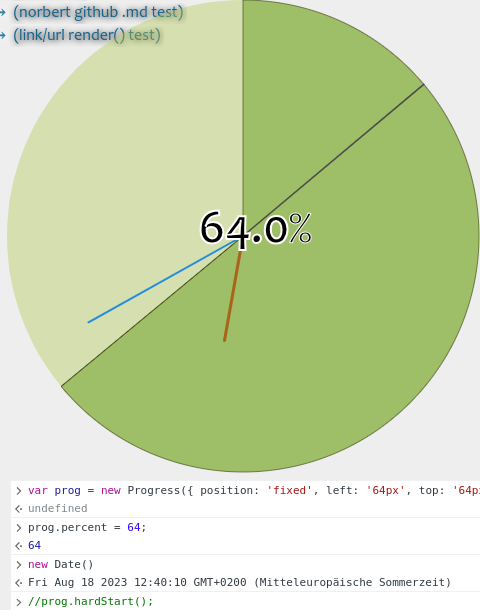

# **`progress`**.js
`class Progress extends HTMLCanvasElement`..

## Example
Beneath a 24h analog clock it also got it's own timer (and countdown).
But here's an example of the clock, with enabled percentage.. here it's
after **12 o'clock**, it's **12:40:10**, to be exact.

**_UPDATE_: This is out-dated, I already improved the progress in many ways!**

