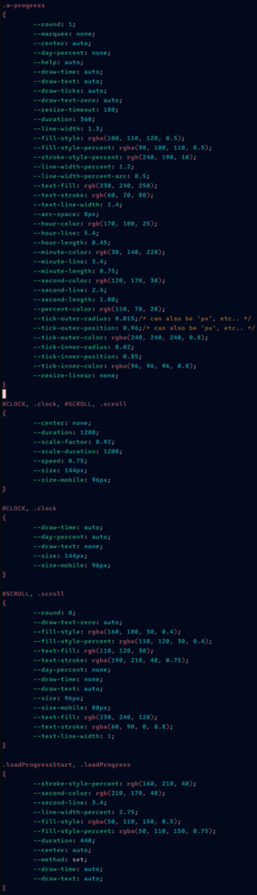

# **`progress`**.js
`class Progress extends HTMLCanvasElement`..

## `(Progress).sizeAnimation(_options, ... _callbacks)`
This is a special case of animations: since the regularily used 'Web Animations API' neither got something like
'intermediateCallbacks' or so, nor the `transform: scale(...)` has a good quality when scaling small elements
to bigger views, I decided to use my own animation routine here.

This is mainly being used for the main 24h clock on the top/right (when clicking/tapping on the small 'preview').

## Example
*_UPDATE_: Last image is out-dated, I already improved the progress in many ways (drawing ticks, and so on)!*

